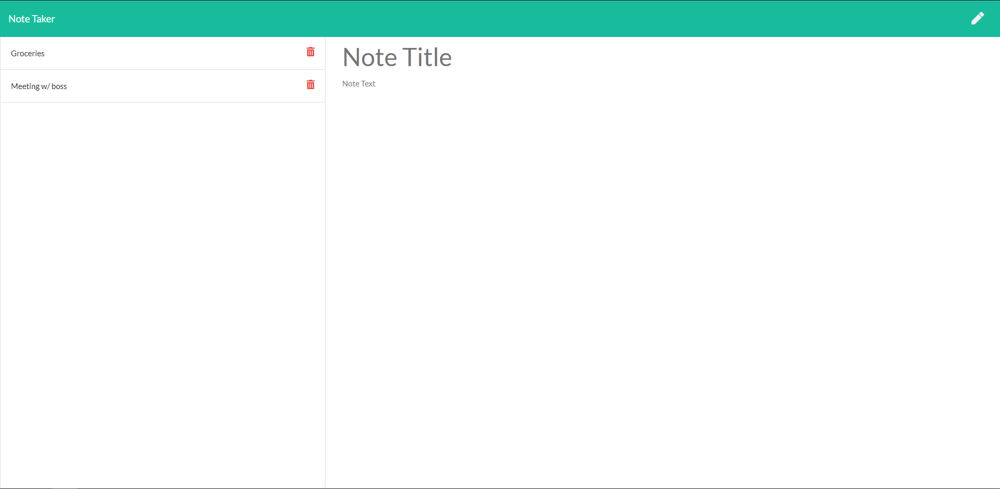

# Note Taker

Deployed at: https://note-taker-tri-gfs.herokuapp.com/

## Assignment

For this assignment, I was tasked with adding functionality to a "note taker" page. The functionality I added includes the ability to save, open, and delete notes. To do this, I created get, post, and delete routes that edit a json file containing the information held in each post, including its title, text, and unique post id.

In completing this assignment, I gained more experience with read from and writing to files using "fs" in JavaScript. It was also good practice with using routes to communicate with a website's backend to add functionality.
